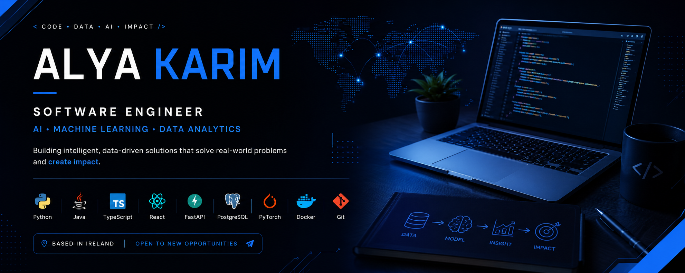

# Hi, I'm Alya

Software engineer and data professional based in Ireland. Recently completed my MSc in Data Analytics at TUS, where I built a drone-assisted human detection system using YOLOv5 and YOLOv8 for search and rescue operations.

Before that, I did a Certificate in Software Engineering with Ericsson, worked as Scrum Master during Sprint 2, and completed a BSc in Applied Physics at UTP where I discovered programming through C and Arduino.

My background is a mix of science, engineering, and software. I like building systems that solve real problems — full-stack apps, machine learning pipelines, databases, AI tools. Lately I'm focused on software engineering while keeping my data science skills sharp.

Outside of code: film photography, painting, journaling, and Spotify.

---

## Featured Projects

### [DevDesk](https://github.com/alymkarim/DevDesk)

Full-stack e-commerce store for developer workspace gear. React, TypeScript, Tailwind CSS, FastAPI, PostgreSQL, Stripe.

- JWT authentication with password reset
- Product reviews with star ratings
- Wishlist with heart icon toggle
- Discount codes (percentage and fixed amount)
- Order tracking with 4-step status timeline
- Shopping cart with guest and logged-in support
- Stripe Checkout integration
- Docker Compose, GitHub Actions CI

**[Live Demo](https://dev-desk-nine.vercel.app)**

---

### [ResearchIQ](https://github.com/alymkarim/researchiq)

Full-stack research paper analysis platform with AI-powered insights, search and comparison. Upload PDF papers and get structured analysis back in seconds using heuristic pattern matching or LLM-powered analysis.

- Semantic search across paper collections
- Side-by-side paper comparison
- Conversational Q&A with papers using RAG
- Paper discovery from Semantic Scholar and arXiv
- Word clouds, keyword networks, methodology timelines
- Export analysis as PDF or DOCX

**[Live Demo](https://researchiq-omega.vercel.app)**

---

### [InsightForge AI](https://github.com/alymkarim/InsightForge-AI)

End-to-end machine learning application for automated model training, comparison, explainability and interactive prediction. Upload a dataset and get trained, explainable predictive models in seconds.

- Automatically adapts to classification and regression problems
- Trains and compares multiple ML models
- Feature importance for model interpretation
- Interactive prediction dashboard
- Supports CSV, Excel and structured PDF data

**[Live Demo](https://insight-forge-ai-bb4f.vercel.app/)**

---

### [DataForge](https://github.com/alymkarim/dataforge)

Data engineering platform for building reliable, observable and scalable pipelines from raw ingestion to analytics and ML-ready data.

- Bronze, Silver and Gold medallion architecture
- Automated data quality validation
- Invalid-record quarantine with lineage preservation
- Pipeline execution and run-history tracking
- Observability dashboard
- PySpark and Delta Lake for distributed processing

**[Live Demo](https://dataforge-ashen.vercel.app/)**

---

### [TaskFlow](https://github.com/alymkarim/taskflow)

Full-stack task and notes management app. FastAPI, PostgreSQL, SQLAlchemy, TypeScript, React.

- Create, edit, complete and delete tasks
- Filtering and optional notes
- Responsive interface
- API and integration tests

**[Live Demo](https://taskflow-six-sandy.vercel.app/)**

---

### [Rescue Vision: Drone-Assisted Human Detection](https://github.com/alymkarim/uav-human-detection)

My MSc research. Real-time computer-vision pipeline for detecting people in aerial imagery for search and rescue operations.

- YOLOv8 with five body-posture classes
- ~0.81 mAP@0.5, ~25-30 FPS on laptop
- Dual-scale and tiled inference
- Object tracking with ByteTrack

**[Live Demo](https://rescuevision.streamlit.app)**

---

### [DeepGuard (Deepfake Detection)](https://github.com/alymkarim/DeepGuard-Deepfake-Detector)

Deepfake video detector. EfficientNet-B0 trained on Vertex AI, exported to ONNX and served from a Flask function on Vercel. Scores a video frame by frame and shows the test metrics next to the verdict.

- Videos split 70/15/15 before any frames are extracted, so no video leaks across the split
- Two-stage training: frozen backbone first, then the last two blocks fine-tuned
- ONNX export verified against PyTorch before it ships
- Face detection in the browser with MediaPipe, only the face crops get uploaded
- Test accuracy 0.513, ROC-AUC 0.548 — the demo page says so too

**[Live Demo](https://deep-guard-deepfake-detector.vercel.app/)**

---

## Other Projects

### Software

**[Developer Portfolio](https://github.com/alymkarim/alya-portfolio)** — React, TypeScript, Vite. Responsive portfolio with interactive project explorer and technical blog. [Live](https://alya-portfolio-jade.vercel.app)

**[UrbanTech Co-Working Spaces](https://github.com/alymkarim/UTCS_Ericsson)** — Java management platform delivered by a six-person Agile team. Authentication, workspace reservations, financial reporting. Served as Scrum Master for Sprint 2.

---

### AI and Machine Learning

**[Parkinson's Disease Prediction](https://github.com/alymkarim/Advanced-Machine-Learning-for-Health-Data-Handwriting-Classification-Parkinson-s-Disease-Regression)** — Explainable ML using sensor-based handwriting data. Random Forest, Decision Trees, KNN with SHAP feature interpretation.

**AI for MedTech** — RUN-EU collaborative research exploring AI for CT and MRI analysis. International multidisciplinary project on medical imaging.

---

### Data Engineering and Analytics

**[Research Data Management System](https://github.com/alymkarim/Research_Project_Data_System_SQL)** — Relational database for scientists, research projects, funding and outcomes. Normalised schema with advanced SQL and PL/SQL queries. [Video](https://youtu.be/-6CFcrz3PiY)

**[MongoDB Research Query Framework](https://github.com/alymkarim/Research-Project-Database-Design-using-MongoDB)** — NoSQL research dataset with 25 structured queries and aggregation pipelines. [Video](https://youtu.be/ImHuT0ZtSoQ)

**[GP Practice Analytics](https://github.com/alymkarim/GP-Practice-Analytics-R-Markdown-Project)** — Operational analytics and reporting for an Irish GP practice. R, R Markdown, dplyr, ggplot2.

**Irish Agricultural Productivity Dashboard** — Tableau dashboard combining crop, weather and market trends for Irish regions.

---

### Research

**[Graphene-Iron Oxide Biosensor](https://iopscience.iop.org/article/10.1088/1755-1315/842/1/012016/meta)** — Award-winning impedimetric biosensor for detecting the mycotoxin zearalenone. SEDEX43 Gold FYP Award, Best Presenter, Best Poster.

**Thermally Conductive 3D-Printing Resin** — Nanocomposite research to improve thermal conductivity of printable resins.

**[Graphene/CNT Foam for Oil-Spill Cleanup](https://github.com/alymkarim)** — Recyclable oleophilic nanomaterial foam for oil-water separation.

**Dye-Sensitized Solar Cells** — Low-cost photovoltaic research focused on improving light absorption.

---

### Sustainability

**[EcoZone Mapper](https://github.com/alymkarim/EcoZone-Mapper-GIS-for-Waste-Management-NASA-Space-Apps-2024-)** — GIS waste-management analytics built for NASA Space Apps 2024.

**[Umbrella Green](https://github.com/alymkarim)** — Award-winning modular rainwater-harvesting concept for climate-resilient cities. EU TalentOn second place.

**[UTP-UIR Riau Community Service](https://www.facebook.com/profile.php?id=100068842090190)** — Solar-panel installation and science outreach for a rural island community in Indonesia. Served as Vice President.

**Auto-Vent** — Automated vehicle ventilation concept to reduce hot-car incidents. Intel CREST semi-finalist.

**Aquatic-Plant Wastewater Treatment** — Team study of natural water treatment measured using flame AAS.

---

## Currently Working On

- **DeepGuard** — retraining on a larger dataset, then scoring videos across frames instead of one frame at a time

---

## Learning

- Full-stack development
- System design and software architecture
- Cloud deployment
- Testing and CI/CD
- Data engineering
- Machine learning engineering

---

## Connect

[LinkedIn](https://www.linkedin.com/in/alya-karim/)

**Comfortable with:**

**Currently learning:**

### 🎧 Currently Listening on Spotify

<!---
alymkarim/alymkarim is a ✨ special ✨ repository because its `README.md` (this file) appears on your GitHub profile.
You can click the Preview link to take a look at your changes.
--->

